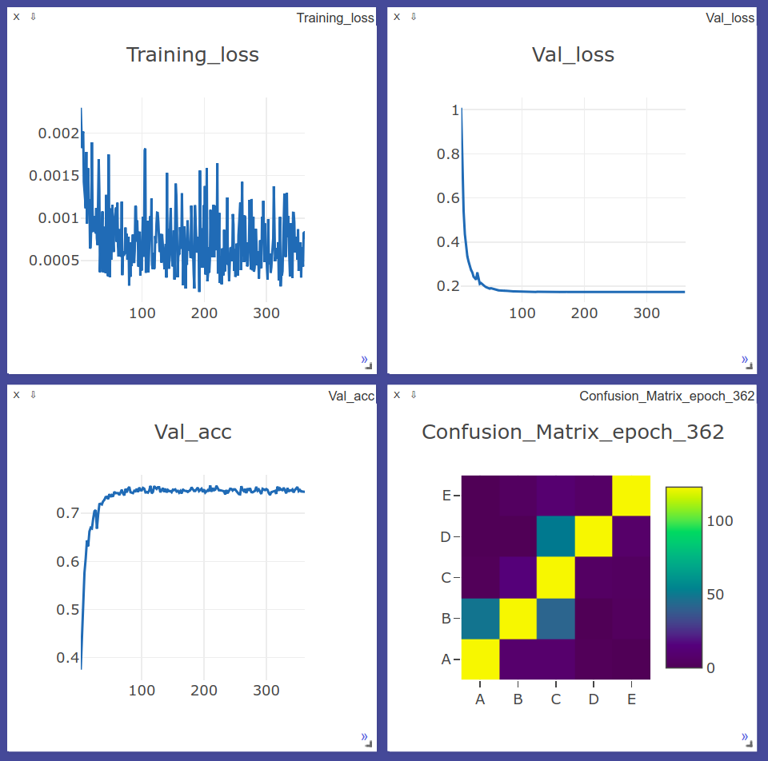

# Human-Activity-Recognition
As lightweight and robust motion sensors are becoming more and more widespread in
our mobile devices, human-activity-recognition (HAR) is becoming an increasingly
common and useful reasearch field. Previous methods include heavily engineered
hand-crafted features extracted from noisy and abundant accelerometer data using
signal-processing techniques and the such. Recent advances in deep neural networks
allows us to bypass this process and allow the network to learn to model the problem
on its own. This project aims to implement such a neural network on an accelerometer
dataset and analyze results.

## Overview
In this project, we take advantage of the modeling capabilities of deep neural
networks to extract deep features from accelerometer data using a convolutional
neural network (CNN). The network consists of 3 convolutional layers, and 2 fully
connected layers, a relatively shallow architecture by today's standards. Our goal
is not to achieve state-of-the-art accuracy, but to demonstrate the benefits of using
neural networks to model the task of HAR, with little to no domain knowledge. We will
provide a short introduction to the HAR task, followed by an analysis of our accelerometer
data. We will then explain the network architecture and our approach to this task, 
and conclude with a brief summary of recent breakthroughs, applications,
and future investigations.

## Background
Human-activity-recognition has been thoroughly researched for decades, with no shortage
of literature documenting various approaches to the task. Most revolve around signal
processing and hand-crafted features used for conventional machine learning models. Recently,
convolutional neural networks, which previously gained recognition for their performance
in computer vision related tasks, have also found applications in sequence modeling such
as HAR, or visual question answering (VQA). 

Recurrent neural networks (RNN), specifically long short-term memory (LSTM) networks,
have also garnered attention on HAR modeling tasks, where inputs from a sequence are
fed to a LSTM network in order by time. The ability of LSTM networks to model recurring 
and causal temporal features through time gives them a particular advantage in modeling 
such a problem as HAR, given that human activities are highly related to previous and 
future movements.

In our simple implementation, we use a vanilla 1D CNN as our model to serve as a starting 
point to explore further models for HAR.

## Data Exploration
We are given around 20K sensor readings of 6 participants performing 5 different actions.
Each reading consists of the pose (roll, pitch, yaw), accelerometer, gyroscope, and
magnetometer measurements, each represented by a 3D vector pointing in the direction of the
reading at the particular timestep, for 4 (belt, arm, forearm, dumbbell) different sensors. 
To gain an insight on what the individual readings mean, accelerometer readings are linear
acceleration measurements, gyroscope reading are rotational velocity measurements, and 
magnetometer readings are vectors pointing north. In common motion sensors, magnetometer 
measurements are often used to reularize accelerometer and gyroscope readings. In this
example, we only use pose, accelerometer, and gyroscope data as input features.

## Prediction Modeling
Our goal is classify human activities from sensor measurements with as little data
engineering as possible. We normalize each individual measurement reading with respect
to readings in the same category across the dataset, and concatenate a reading at 
a single timestep into a 40 x 1 feature vector to be used as input. The feature vector
is then passed through a 1D CNN with 3 conv layers and 2 fully connected layers. Each layer
is followed by a ReLU activation function and a dropout layer. Our initial learning rate
is 0.003, with a decay rate of 0.95 per epoch. We use a 0.2 split ratio for training and 
validation data (80% training, 20% validation) and achieve 75% accuracy after 300 epochs. 

### Train on accelerometer dataset
We use PyTorch 1.0 in our implementation. Run the following to install pytorch, or head to
their website https://pytorch.org/get-started/locally/ and follow installation instructions.
```
pip3 install torch torchvision
```
We use `visdom` for logging. Run the following command to install visdom.
```
pip install visdom
```

Run the following commands to see a training example on the provided dataset:
```
cd ~/
mkdir github
cd github
git clone https://github.com/jchiang2/Human-Activity-Recognition.git
cd Human-Activity-Recognition
python train.py
```
Models are saved to the `Checkpoints` directory. If you wish to continue training 
from a checkpoint, you may instead run the last command as:
```
python train.py --checkpoint /path/to/checkpoint.pth
```
If you wish to alter any parameters, you may do so in `config/set_params.py`.

To see Visdom plots, please navigate to the following url on your local machine,
http://yourIPaddress:8097. The default port for Visdom is `8097`.

### Example training plots


### Test on accelerometer data
Run the following command to perform inference on the provided test dataset:
```
cd ~/github/Human-Activity-Recognition
python test.py --checkpoint /path/to/trained/model.pth
```

## Model Application
We see that with a simple CNN, we can achieve 75% classification accuracy on the given
dataset of 5 classes, demonstrating the effectiveness of neural networks on HAR problems.
Even though our implementation only leverages sensor readings at specific timesteps, and
not sequences of timesteps, we may still achieve sensible accuracy, due to the fact that 
temporal characteristics are embedded in the sensor data, thus allowing the model to gain
slight insight about the underlying motions. More sophisticated approaches include
feeding input data over a sequence of time at once, thus including more temporal data, 
or using a CNN-LSTM approach, extracting features with a CNN, then passing these feature 
maps to an LSTM to learn and classify time sequences. Current state-of-the-art approaches 
obtain around 90% accuracy on community OPPORTUNITY and UniMiB-SHAR datasets, a astonishing
and promising feat in the field, leaving room for a multitude of applications.

## References
* M. Zeng et al., "Convolutional Neural Networks for human activity recognition using mobile sensors," 6th International Conference on Mobile Computing, Applications and Services, Austin, TX, 2014, pp. 197-205.
* F. Ordóñez, D. Roggen, "Deep Convolutional and LSTM Recurrent Neural Networks for Multimodal Wearable Activity Recognition," Sensors 2016, 16, 115.
* F. Li, K. Shirahama, M.A. Nisar, L. Köping, M. Grzegorzek, "Comparison of feature learning methods for human activity recognition using wearable sensors," Sensors 2018, 18, 679.
